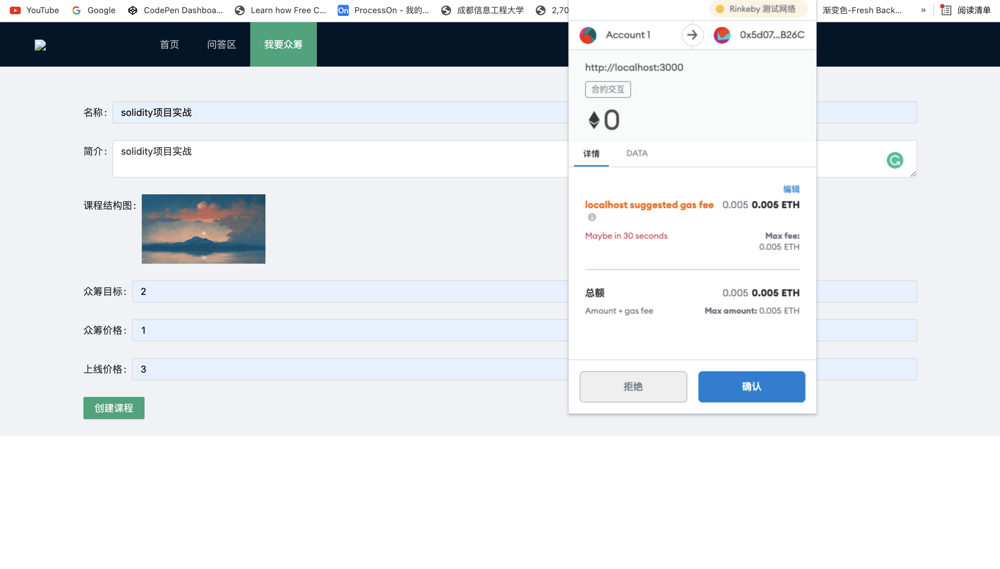
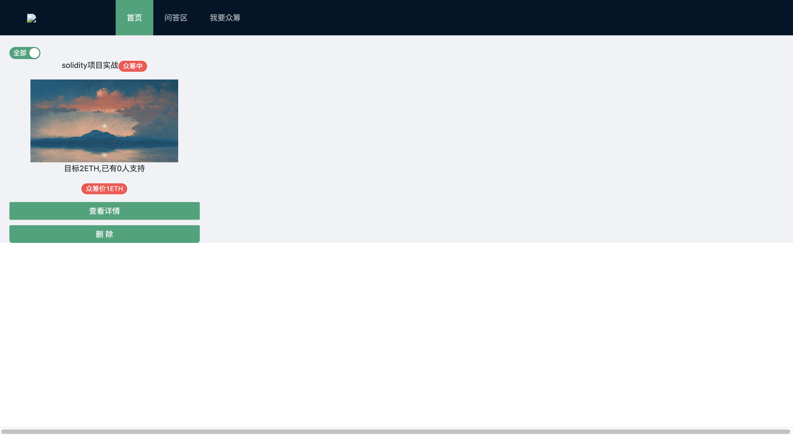
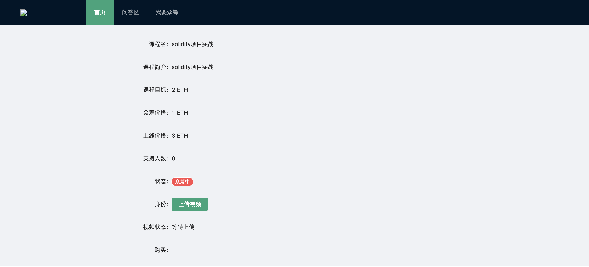
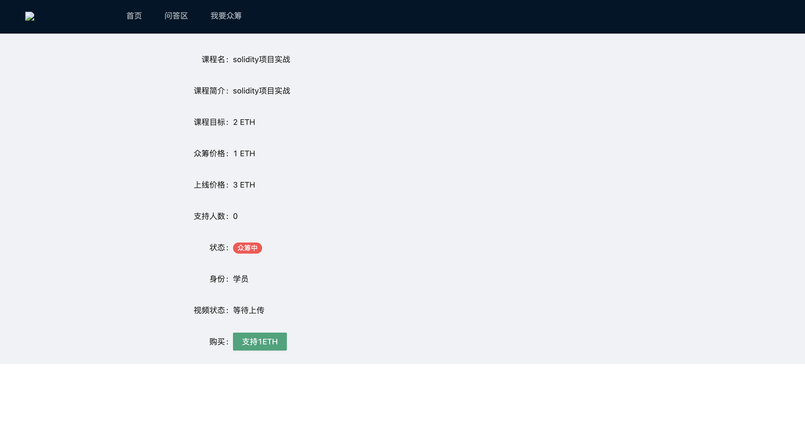
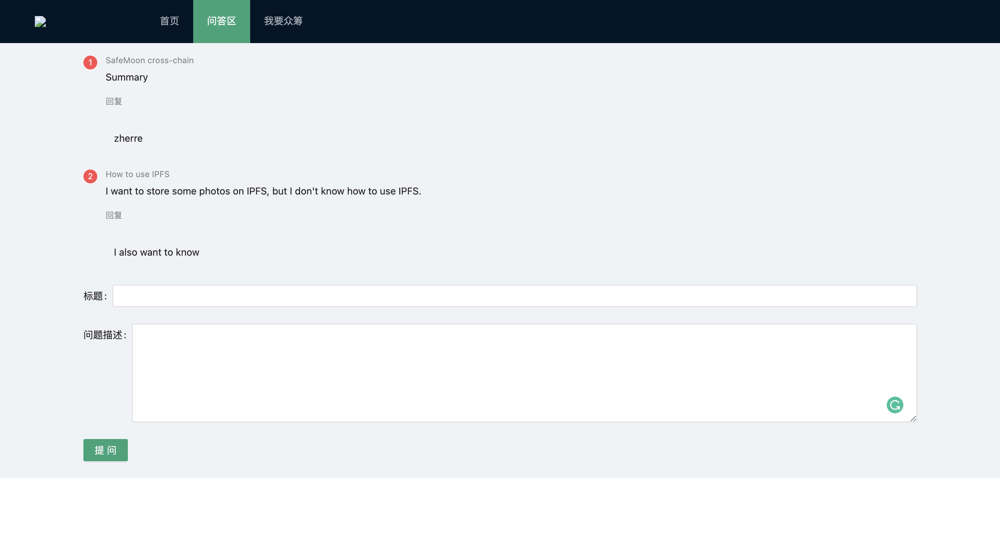

# IMOOC_ON_BLOCKCHAIN

## Summary

A crowdfunding project about release online courses and buy some project on blockchain. Buyer can buy some courses they like. But it is worth your attention that every course price is different between before crowdfunding and after crowdfunding.  People can also ask their question about some course in question area. 

## Technology

`React` `Solidity` `IPFS`

## Start using

### deploy

Open terminal and input:

`````````bash
npm run deploy
`````````

### start react

```bash
npm start
```

## Function

#### 1. Release a crowdfunding course



`notice:the image of course is stored on ipfs`

#### 2. We can see it that we just creaed  on index page

​	

`notice: the manager of course can delete their course or see their course detail`

#### 3. Some detail  about course





`notice: If account is a manager, they can upload a video about this course. but if account is a buyer, they can buy this course in crowdfunding price`

#### 4. Question Area

people can ask some question in question area



`notice: these question will be stored on IPFS`
